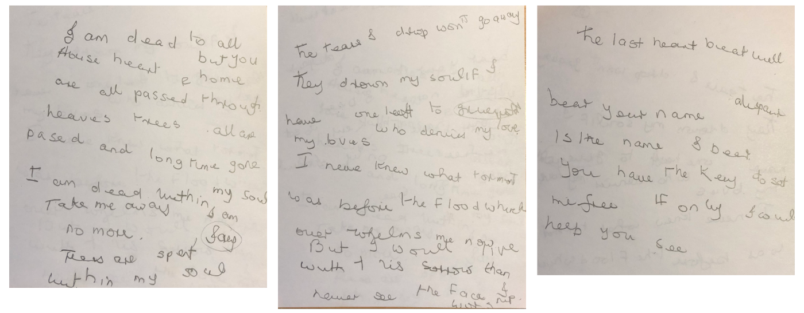

<figure style="width: 92%; margin: 1em auto; border-bottom: 1px solid gray; margin-bottom: 1em">
  
  <figcaption style="text-align: center;">The original pages—Vera’s last writing</figcaption>
</figure>

I am dead to all but you  
House, heart and home are all passed through  
Leaves, trees all are passed and long time gone

I am dead within my soul  
Take me away, I am no more  
Tears are spent within my soul

The tears I drop won’t go away  
They drown my soul if I have one left to grieve  
Who denies my love, my loves

I never knew what torment was  
Before the flood which  
Overwhelms me now

But I would live with this sorrow  
Than never see the face I worship  
The last heartbeat will bear your name

Despair is the name I bear  
You have the key to set me free  
If only I could help you see
