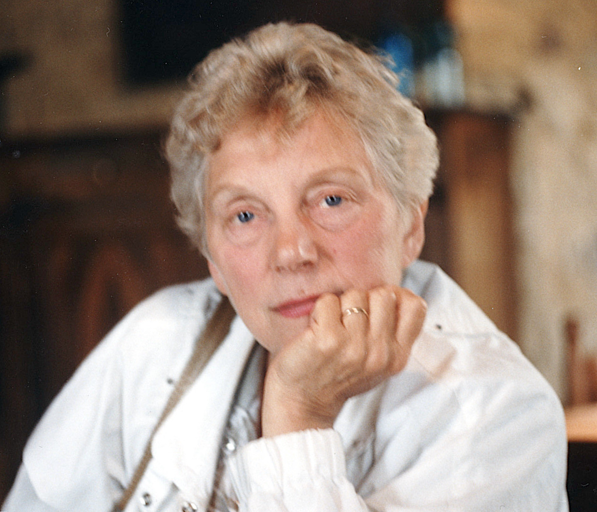

# Vera Everitt: Writing

<figure style="max-width: 72%; margin: 1em auto; font-size: .9em; text-align: center;">
  
  <figcaption>Born: Vera May Hill, London 1924, died: Wigston 2023</figcaption>
</figure>

This collection of [my mother’s writing](https://daveeveritt.github.io/vera-everitt-writing/) covers many topics and is just a start. Dates aren’t always given, and the writing style is retained as is (the very few obvious errors are corrected). She moved to Swansea as a child, served as a WREN in World War II (her account of that time is in progress) and lived there until she married Bill Everitt (his memoirs are also in progress) and moved to Leicester. She was mother to myself (Dave) and my brother Chris. She was a keen tennis player and a lover of the outdoor life in general. In later life she developed an interest in broad spiritual questions—the search for meaning and inner peace—drawing on roots a little deeper than much of the current *New Age* movement.

Alzheimer’s gradually began to set in after these writings, and although she eventually became unable to see or recognise anyone, during the earlier stages she did enjoy listening to her [Camping Diaries](https://vera.fania.uk) (available on another website, thanks to my wife Fania for typing them up from several folders and laboriously scanning all the attached images). Vera died after a long period of the more severe stages of the condition. Her last piece of writing is a revealing and heartbreaking poem “[Dead to All](poem-dead-to-all/)”. The final recognisable part of her personality to go was her deep and lifelong love of singing.

from family friends who knew her:

> We have fond memories of Vera, her good humour, her enthusiasm for life and her generous sprint.

<!-- Paul Foster -->

> I remember meeting her years—well, decades—ago and though I never got to know her well I was always struck by her strong character, phenomenal energy, and her openness to new ideas. 

<!-- Alison Love -->

## Index

- [A Day in The Life of a WREN](day-as-a-wren/) (1943, age about 19-20)
- [Human Life](human-life/)
- [Trip to Poland](trip-to-poland/) (Auschwitz and Birkenau)
- [Letter to Friends](letter-to-friends/)

### Spiritual Thinking

- [Introduction](spiritual-thinking/)
- [Close to the Earth](spiritual-thinking/close-to-the-earth/)
- [The Rays](spiritual-thinking/the-rays/)
- [Visionary Observations](spiritual-thinking/visionary-observations/)

### Poems

- [Dead to All](poem-dead-to-all/)