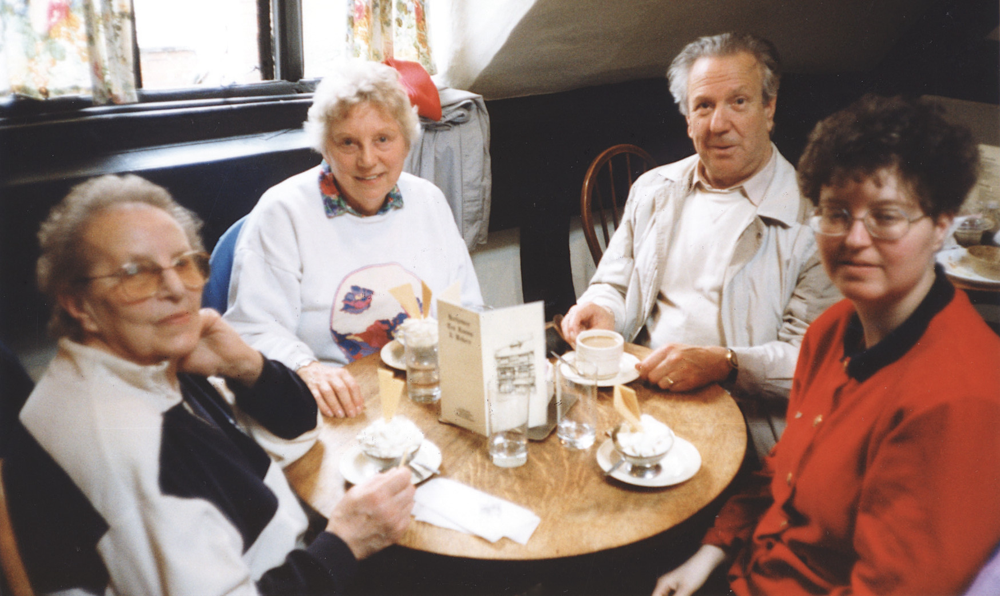

# Auschwitz and Birkenau (entitled “Trip to Poland”)

<figure style="width: 90%; margin: 1em auto;">
  
  <figcaption>L-R: Madame Pecan, Vera Everitt, Bill Everitt, Marianne</figcaption>
</figure>

Background: Vera and Bill Everitt became friends with Madame Pecan, who lived in France and survived a concentration camp in WW2, and her granddaughter Marianne, who wanted to take the trip to the place her granmdmother was held.

## 29/05/1998

I am writing this diary to remember the trip I’m taking with Marianne, the granddaughter of my friend Germain Pecan, who asked me to do this. I was honoured to be asked and so, on 29th May 1998, having arrived two days earlier from (Vera’s youngest son and daughter-in-law) Chris & Maxine’s home, (we caught the ferry 2 days earlier). Bill (Vera’s husband) took us to la gare in Rouen, the train was sitting there—very smart SNCF and comfortable. There were a few commuters, and with 4 stops before Paris, a few more by Paris. It followed the Seine for the most part and we duly arrived in Paris at 7:05. We hailed a taxi outside the station and made our way to Roissy where we were alone for a long time. Then the group arrived and I was introduced to most of them by Marianne.

The plane, a Boeing 737 was delayed by 3/4hr, but it was quite an experience. The country below changed from industry and ancient building as we climbed above it all! On the fuselage inside the plane are emergency exits—and one that says WYJCHI EXIT—for witches and broomsticks? We were met at the airport by ‘le Car’ (bus or coach) and made our way to the hotel—typical modern chain hotel. Food very good, after we spent some time in the *hot* sun on the terrace. I had a short walk before dinner. We went to bed about 11 but needed to rise at 5:45 which we did.

## 30/05/1998

Woke up before the alarm, tried to get rid of baggy eyes, without much success. It’s a hot day and we’re off to Auschwitz. It was a long journey and the countryside is either woody, or scrubby grass land. The peasants mow it and gather it into haystacks—well, grass stacks—by hand and a pitchfork, the remaining grassy heap looks like this (sketch of grassy ‘dome’). The countryside changed little, but we crossed a canal and railway which I think probably joined up with the one to Auschwitz. We did arrive eventually—covered in leaves… well, not quite are we are sitting just behind the roof opening upstairs and as they don’t cut the trees across the road, the ‘car’ (coach) does, as it’s higher than much else. The traffic isn’t very bad, in fact it’s probably more like non-existent, even in towns.

Many houses or farms are isolated and there isn’t much choice between scrubby grassland and forest. There are isolated towns—or villages really, with the odd petrol station on the way. Auschwitz *is* isolated although people do live in the vicinity. We stopped in a park-like area with trees and grassland. Nothing much to see, as we walked towards the camp. There were buildings dotted around as we moved to a tree-lined area where we could see the entrance to the museum, and the blocks of brick barracks. There was a watch-tower, a high building at the back—it was the view(?) watch. We met our guide (I could not understand much of what he said!) who eventually led us to the gate “Arbeit Macht Frei”. Marianne and I tried to take pictures of it but neither of our cameras worked. We found out why, when we got back to the hotel! My batteries needed cleaning—she hadn’t put any in hers! The effect was the same—no pictures.

The whole camp is a museum, albeit a grim one. My total impression was one of greyness everywhere. All the exhibits were grey—blankets—or cloth rather, made out of human hair. the locks of hair in a large display case—all turned to grey. The shoes—all grey except for a small child’s red one, and a woman’s dirty white sandal. A (display) case full of ‘cases’, valises with names on, all shapes and sizes. Cooking pots in another case—or perhaps just pots to eat from.

I know of course of the atrocities, as I was a young girl at the beginning of the war, but gradually, the news filtered through to us, and although we didn’t know the extent to which the Nazis would were prepared to go in order to eliminate “Les Juifs” (the Jews), we still found it unbelievable that such things could happen in the 20th century. As a schoolgirl I was familiar with the Middle Ages and the instruments of torture that were employed—but I thought in my innocence that these atrocities could not possibly happen in my enlightened century. This was my first lesson in the (???) side of worldly life!

## 31/05/1998

Today we go to Berkanhaue (Birkenau) where Germaine Pecan was held. This is “just down the road” from Auschwitz and has the dreaded railway line which passes through the portals of the camp and proceeds to a siding with a platform where the prisoners disembarked. The German guards stood around the prisoners, looking them over, separating women & children from men, shooting those they did not consider “worth keeping”, the old, the infirm, etc. Many things happened—there are books to read.

Then we, as a group proceeded to climb the watchtower from which every aspect of the camp could be seen. We walked along the road and saw inside some of the huts, like one with long lines of loos down the middle, and just a slop to let the excrement drain away—perhaps under the huts! There was no privacy, and the children who were kept alive for work, slept under the wooden platforms which were built either side, where I don’t know how many adults slept. We walked all over the camp which was very huge, but I felt I was making a pilgrimage for all those who lived and also those who died there. We (Marianne & I) placed a bouquet of flowers in the hut where Germaine had lived.
